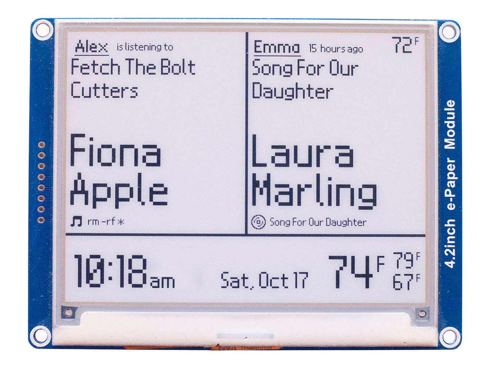

# 4.2in E-Paper Spotify Weather Clock 
This project uses Python3 to display two user's recent Spotify history, weather for two cities (local and away), and the current time 

	
	

Written for [Waveshare's 4.2 e-paper display](https://www.waveshare.com/4.2inch-e-paper.htm), this project connects with Spotify's API to display the most recent listening information, including the title, artist, context, and time since the track was played. There is a left and right panel so that two folk's listening can be displayed at the same time. The forcast and current weather are also displayed via the OpenWeatherMap api. The e-paper display updates in full every 3 minutes per Waveshare's recommendations. After 8pm, the display updates every 5 minutes, and does not update from 2am - 6am. Open invite to email me, atscott@ucsc.edu, if you have any questions regarding my implementation, or suggestions regaring how to improve this project. Before you ask, I am using the Nintendo DS BIOS font for this project because it looks beautiful.

### Installation
Waveshare provides a set of [instructions](https://www.waveshare.com/wiki/4.2inch_e-Paper_Module) under the Hardware/Software setup tab to install the libraries required to drive the display. I'm using a [Raspberry Pi Zero W](https://www.raspberrypi.org/products/raspberry-pi-zero-w/) running this [bash script](https://github.com/alexthescott/ePaper-Spotify-Clock/blob/master/launch_epaper.sh) in [rc.local](https://www.raspberrypi.org/documentation/linux/usage/rc-local.md) to run [mainSpotifyClock.py](https://github.com/alexthescott/ePaper-Spotify-Clock/blob/master/mainSpotifyEPD.py). 

This project uses three custom Python modules, [Spotipy](https://spotipy.readthedocs.io/en/2.12.0/), [Requests](https://requests.readthedocs.io/en/master/), and [Pillow aka PIL](https://pillow.readthedocs.io/en/stable/), all of which can be installed using [Pip](https://pip.pypa.io/en/stable/)

### Relevant EPD Files
mainSpotifyEPD.py -> Drives the epd, and calls all functions

drawToEPD.py -> Functions to write to our PILLOW image object

localJsonIO.py -> Write to a local .txt JSON file for contextual info

ePaperFonts & Icons -> Resources used to draw to the screen
 
### APIs 
[Openweathermap](https://openweathermap.org/api) gets the current weather and forcast, and the [Spotipy](https://github.com/plamere/spotipy) wrapper interfaces with Spotify's API
