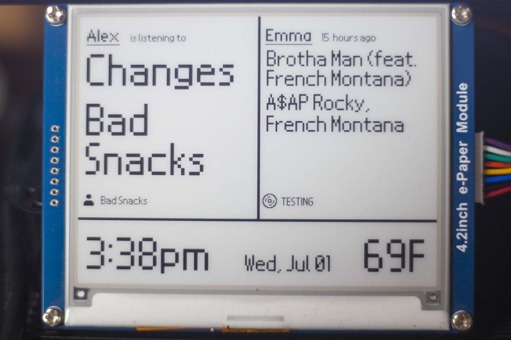

# 4.2in E-Paper Spotify Weather Clock 

Written for Waveshare's 4.2 e-paper display, this project connects with Spotify's API to display the most recent listening information, including the title, artist, context, and time since the track was played. There is a left and right panel so that two folk's listening can be displayed at the same time. The forcast and current weather are also displayed via the OpenWeatherMap api. The e-paper display updates in full every 3 minutes per Waveshare's recommendations. After 8pm, the display updates every 5 minutes, and does not update from 2am - 6am. Open invite to email me, atscott@ucsc.edu, if you have any questions regarding my implementation, or comments regaring how to improve this project. Before you ask, I am using the Nintendo DS BIOS font for this project because it looks beautiful.

## Files
mainSpotifyEPD.py -> Drives the epd, and calls all functions
drawToEPD.py -> Functions to write to our PILLOW image object
localJsonIO.py -> Write to a local .txt JSON file for contextual info
ePaperFonts & Icons -> Resources used to draw to the screen
 
### OpenWeatherMap API 
This project samples the weather from a given city every 15 minutes at no cost. More information can be found at https://openweathermap.org/api

### Spotipy Documentation
https://github.com/plamere/spotipy/blob/master/docs/index.rst
https://spotipy.readthedocs.io/en/latest/

**This project supports the Waveshare 4.2inch B&W display, and has been tested with Python 3.7.3**

The Python library used in this project was provided by Waveshare, and can be found here:
https://github.com/waveshare/e-Paper
