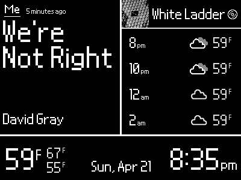
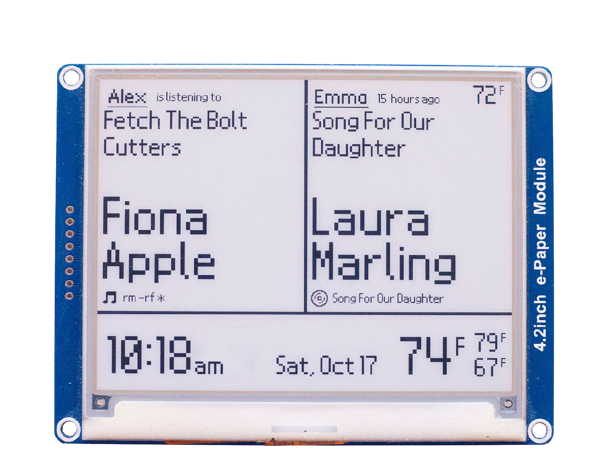

# RaspberryPi E-Paper Spotify Clock  

<p align="center">
	
	
</p>

### 🕰️ Quick Project Overview
This is a E-Paper Clock built with Python3 to display [two](https://open.spotify.com/user/bassguitar1234?si=hHnnqHUGTe25liNezp9cJQ) [users'](https://open.spotify.com/user/ermisk?si=0G5DmMxCRLuUm1G6-EWhFA) recent Spotify history, and the local weather. Written for [Waveshare's 4.2 e-paper display](https://www.waveshare.com/product/4.2inch-e-paper-module.htm), the E-Paper Clock uses Spotify's API via [Spotipy](https://spotipy.readthedocs.io/en/2.22.1/) to display the recent listening information, and the [OpenWeathermap](https://openweathermap.org/) API to get the current and forecasted local weather. Email me, atscott@ucsc.edu, if you have any questions regarding the implementation, suggestions to improve the project, or if you built one yourself!

#### 2024 rewrite notes

Install imagemagick via 
sudo apt-get install imagemagick
as it's used in dither_image()

### ⌛ Quick Install Guide
Waveshare provides a set of [instructions](https://www.waveshare.com/wiki/4.2inch_e-Paper_Module) under the Hardware/Software setup tab to install the libraries required to drive the display. I'm using a [Raspberry Pi Zero W](https://www.raspberrypi.org/products/raspberry-pi-zero-w/) running this [bash script](https://github.com/alexthescott/ePaper-Spotify-Clock/blob/main/launch_epaper.sh) in [rc.local](https://www.raspberrypi.org/documentation/linux/usage/rc-local.md) to run [mainSpotifyClock.py](https://github.com/alexthescott/ePaper-Spotify-Clock/blob/main/mainSpotifyClock.py). Three custom Python modules were used, [Spotipy](https://spotipy.readthedocs.io/en/2.12.0/), [Requests](https://requests.readthedocs.io/en/master/), and [Pillow aka PIL](https://pillow.readthedocs.io/en/stable/), all of which can be installed using [Pip](https://pip.pypa.io/en/stable/). [Openweathermap](https://openweathermap.org/api) gets the current weather and forecast, and the [Spotipy](https://github.com/plamere/spotipy) wrapper interfaces with Spotify's API

Drive the EPD, call necessary functions -> [mainSpotifyClock.py](https://github.com/alexthescott/ePaper-Spotify-Clock/blob/main/mainSpotifyClock.py)

Image and Front Resources -> [Icons](https://github.com/alexthescott/ePaper-Spotify-Clock/tree/main/Icons) and [Fonts](https://github.com/alexthescott/ePaper-Spotify-Clock/tree/main/ePaperFonts) 
 
### ⏳ Full Instillation Guide 
1) In the 'Hardware/Software setup' tab of Waveshare's [4.2inch wiki](https://www.waveshare.com/wiki/4.2inch_e-Paper_Module), use the GPIO guide to attach the display to the Pi

2) Enable SPI interface by launching raspi-config, choosing 'Interfacing Options', 'SPI', Yes to enable SPI interface


```bash
sudo raspi-config
# Interfacing Options -> SPI -> Yes
```

3) Install Python libraries

```bash
sudo apt-get update
sudo apt-get install git python3-pip python3-pil python3-numpy
sudo pip3 install RPi.GPIO
sudo pip3 install spidev
sudo pip3 install spotipy
sudo pip3 install requests
```

As an aside, sudo pip install is generally frowned upon, but these are popular and vetted packages which won't pose security threats to your system

4) Download Waveshare Examples and Python Libraries

```bash
sudo git clone https://github.com/waveshare/e-Paper
```

5) Navigate to Pi/Python folder, and Install 'waveshare-epd' Python module from setup.py

```bash
cd e-Paper/RaspberryPi\&JetsonNano/python
sudo python3 setup.py install
```

6) Navigate to Pi/Python/examples folder, and run the Waveshare's provided example file to make sure the wiring is correct

```bash
cd examples
sudo python3 epd4in2.py
```

7) Clone this repository into the examples folder 

```bash
sudo git clone https://github.com/alexthescott/ePaper-Spotify-Clock
```

8) Use a text editor such as Vim, Emacs or nano open [launch_epaper.sh](https://github.com/alexthescott/ePaper-Spotify-Clock/blob/main/launch_epaper.sh) and replace YOUR_USERNAME, then move file into your home directory

```bash
# If you choose Vim, first open the file
vim launch_epaper.sh
# Press i for insert mode, replace USERNAME, then write and quit with :wq
:wq
# Move to launch_epaper.sh to home directory
mv launch_epaper.sh /$HOME
```

9) For both Spotify users, login to the [Spotify Developer Portal](https://developer.spotify.com/dashboard/), create an app, write down the Client ID and Client Secret as we will use these later

10) On the Spotify Developer Portal, add http://www.google.com/ as the Redirect URI, and save at the bottom

11) Create a free [OpenWeatherMap account](https://home.openweathermap.org/users/sign_in), and navigate to your profile, and then [API keys](https://home.openweathermap.org/api_keys). Generate and store a new key as it will be inserted into mainSpotifyEPD.py

12) Using a text editor, place the generated Spotify Client Id, Client Secret and openWeatherMap key into config/keys.json

13) Navigate to your home directory, make launch_epaper.sh an executable, and then run it as the super user

```bash
cd $HOME
chmod +x launch_epaper.sh
sudo ./launch_epaper.sh
```

14) You will be asked to paste two URLs into a web browser to link the Spotify accounts to the project. The first request corresponds with the user on the left, and the second request corresponds with the user on the right. After accepting Spotify's terms, copy and paste the full Google url back into the terminal.

15) If everything runs well, consider adding launch_epaper.sh to rc.local which runs at boot

```bash
sudo vim /etc/rc.local
# above exit 0, add 'bash /home/YOUR_USERNAME/launch_epaper.sh &'
```
16) Give yourself three cheers for following along and building the project! Huzzah  🎉

If you made this project, I'd love to see it! Send me an [email](atscott@ucsc.edu) with a photo of your finished project