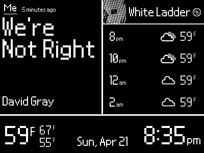
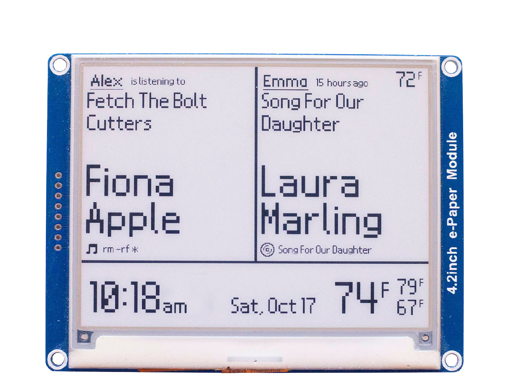

# ePaper Clock: Spotify and Weather
### TLDR: Desktop clock designed primarily to help read/see Spotify listening info

<p align="center">
	
	
</p>

### 🕰️ Quick Project Overview
Python + Bash with a Raspberry Pi and [Waveshare's 4.2in ePaper display](https://www.waveshare.com/product/4.2inch-e-paper-module.htm) and ePaper library, using [Spotipy](https://spotipy.readthedocs.io/en/2.22.1/) for track info, [OpenWeathermap](https://openweathermap.org/) for weather info, and [Pillow](https://pillow.readthedocs.io/en/stable/) to generate/display image.

### 💽 Technical Overview
- main.py only engages with ePaper functionality after determining the availability of Waveshare's epd library.
```bash

python3 main.py --clock		# push image to ePaper or save local .png every ~3 minutes most of the day 
python3 main.py --local		# generate local test_output/clock_output.png 
python3 main.py -v 		# enable STDOUT logging
```
- launch_epaper.sh is a single-shot runner for main.py, intended to be invoked by systemd (see Install Guide below) which handles restarts/backoff.
```bash

./launch_epaper.sh --clock	# push image to ePaper or save local .png every ~3 minutes most of the day 
./launch_epaper.sh --local	# generate local .png
./launch_epaper.sh -v 		# enable STDOUT logging
```

### 🔒 Security Note
`config/keys.json` holds your Spotify client secrets and OpenWeatherMap key — never commit it. It's listed in `.gitignore`, and `make setup` only ever populates it from the empty `config/keys.json.example` template, never with real values.

If you're picking up this repo from a clone/fork made before this note was added: check whether `config/keys.json` is tracked in git history (`git log --all -- config/keys.json`). If it is, treat any credentials that were ever committed as compromised — regenerate the Spotify app secret at the [Spotify Dashboard](https://developer.spotify.com/dashboard) and the key at [OpenWeatherMap](https://home.openweathermap.org/api_keys), then `git rm --cached config/keys.json` so it stops being tracked going forward.

### ⌛ Install Guide
- We presume you have a headless Raspberry Pi (I use a Zero W 2) with Waveshare's 4.2inch ePaper display attached via GPIO and SPI enabled via `raspi-config`.
- Clone this repository and run the automated setup:
	```bash
	git clone <this-repo-url>
	cd ePaper-Spotify-Clock
	make setup
	```
	`make setup` will (idempotently, safe to re-run):
	- create a Python virtualenv (`.venv`) and install `requirements.txt`
	- install system packages (`system-deps`: git, python3-pil, python3-numpy, imagemagick, RPi.GPIO, spidev)
	- clone and install Waveshare's e-Paper driver library from [waveshare/e-Paper](https://github.com/waveshare/e-Paper) (`waveshare` target — not on PyPI, pulled straight from their repo)
	- copy `config/keys.json.example` to `config/keys.json` if it doesn't already exist (never overwrites an existing config)
	- generate and install a systemd unit (`epaper-clock.service`), enabling it on boot (does not start it yet — see next steps)

	Running `make setup` on a non-Pi/non-Linux machine automatically skips the Pi-only steps (`system-deps`, `waveshare`, `systemd`) with a warning, so you can still use it to set up a local dev venv.
- Edit `config/keys.json` with one or two Spotify users' client id/secret from [Spotify's Create App page](https://developer.spotify.com/dashboard) and a free [OpenWeatherMap token](https://home.openweathermap.org/api_keys).
- **Complete Spotify OAuth interactively before starting the service** — the systemd service runs non-interactively and can't complete the initial browser-paste auth flow:
	```bash
	python3 main.py --local
	```
	Follow the printed URL, paste the redirect link back into the terminal. Repeat for a second user if configured.
- Start the service:
	```bash
	sudo systemctl start epaper-clock
	systemctl status epaper-clock
	journalctl -u epaper-clock -f
	```
	(App-level logs also live in `cache/clock.log`, independent of `journalctl`.)
- For local development/testing without ePaper hardware: `make local-test` (equivalent to `python3 main.py --local`), which renders to `test_output/clock_output.png` via the automatic hardware-unavailable fallback.

### 🔁 Re-authorizing Spotify
Spotify caps refresh tokens at **180 days from the moment you originally authorized the app** — refreshing the access token (which the clock does automatically every hour) does *not* reset that clock. When it expires, Spotify's API starts returning `invalid_grant`; the clock detects this, stops hammering the token endpoint, and logs that re-authorization is needed (`cache/clock.log`). Nothing about the credentials themselves is wrong — you just need to redo the login/consent step.

Starting ~14 days before expiry, the clock also shows a banner right on the display — a black pill in place of the bottom bar's date, e.g. `! REAUTH 9D`, with the date bumped up above it so you don't lose it. Once the token actually expires, it switches to `! REAUTH NEEDED`. No need to watch the logs for this — a glance at the clock is enough.

Because Spotify now requires OAuth redirect URIs to be either HTTPS or the literal loopback address `127.0.0.1`, re-authorizing a headless Pi can't be done by just clicking a link on your phone over the LAN. Instead, forward the Pi's loopback port to your laptop over SSH and do the login from there:

1. From your laptop (not the Pi), open a tunnel to the Pi's port 8080:
	```bash
	ssh -L 8080:localhost:8080 <pi-user>@<pi-host>
	```
	Leave this terminal open — it's just a tunnel, not where you run the next command.
2. In a **second** terminal, SSH into the Pi normally and run:
	```bash
	cd ePaper-Spotify-Clock
	make reauth
	```
	(Pass `ARGS=--secondary` to re-auth the second user instead of the main one, if you've configured two.)
3. It prints a link — `http://127.0.0.1:8080/`. Open that in a normal browser **on your laptop** (the SSH tunnel from step 1 routes it to the Pi). Click through, log into Spotify if prompted, and hit Agree.
4. The Pi's script catches the redirect automatically, exchanges it for a fresh token, and writes it straight to `cache/.authcache1` (or `.authcache2`) — no copy-pasting URLs, no restarting the service. The clock resumes on its own within one tick.

Once re-authorized, the banner clears on the clock's next tick and the date returns to normal.
