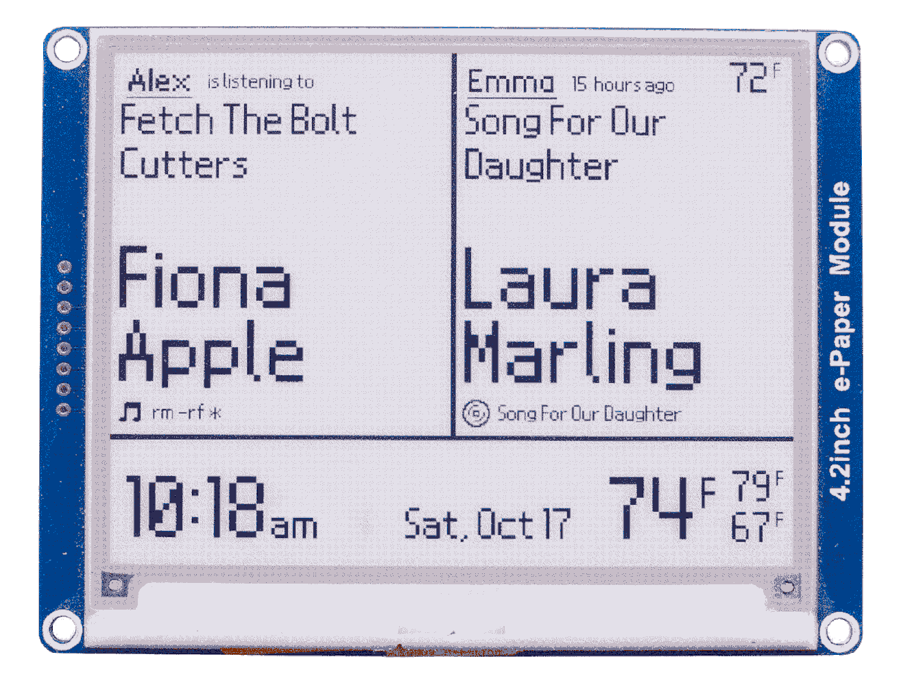

# 4.2in E-Paper Spotify Weather Clock 
This project uses Python3 to display [two](https://open.spotify.com/user/bassguitar1234?si=hHnnqHUGTe25liNezp9cJQ) [users'](https://open.spotify.com/user/ermisk?si=0G5DmMxCRLuUm1G6-EWhFA) recent Spotify history, weather for two cities (local and away), and the current time 

<p align="center">
	
	
</p>

Written for [Waveshare's 4.2 e-paper display](https://www.waveshare.com/product/4.2inch-e-paper-module.htm), this project connects with Spotify's API to display the most recent listening information, including the title, artist, context, and time since the track was played. There is a left and right panel so that two folk's listening can be displayed at the same time. The forcast and current weather are also displayed via the OpenWeatherMap api. The e-paper display updates in full every 3 minutes per Waveshare's recommendations. After 8pm, the display updates every 5 minutes, and does not update from 2am - 6am. Before you ask, I am using the Nintendo DS BIOS font for this project because it looks beautiful. Email me, atscott@ucsc.edu, if you have any questions regarding the implementation, suggestions to improve the project, or if you built one yourself!

### ⌛ Quick Overview 
Waveshare provides a set of [instructions](https://www.waveshare.com/wiki/4.2inch_e-Paper_Module) under the Hardware/Software setup tab to install the libraries required to drive the display. I'm using a [Raspberry Pi Zero W](https://www.raspberrypi.org/products/raspberry-pi-zero-w/) running this [bash script](https://github.com/alexthescott/ePaper-Spotify-Clock/blob/master/launch_epaper.sh) in [rc.local](https://www.raspberrypi.org/documentation/linux/usage/rc-local.md) to run [mainSpotifyClock.py](https://github.com/alexthescott/ePaper-Spotify-Clock/blob/master/mainSpotifyEPD.py). Three custom Python modules were used, [Spotipy](https://spotipy.readthedocs.io/en/2.12.0/), [Requests](https://requests.readthedocs.io/en/master/), and [Pillow aka PIL](https://pillow.readthedocs.io/en/stable/), all of which can be installed using [Pip](https://pip.pypa.io/en/stable/). [Openweathermap](https://openweathermap.org/api) gets the current weather and forcast, and the [Spotipy](https://github.com/plamere/spotipy) wrapper interfaces with Spotify's API

Drive the EPD, call necessary functions -> [mainSpotifyEPD.py](https://github.com/alexthescott/ePaper-Spotify-Clock/blob/master/mainSpotifyEPD.py)

Write to Pillow Image Object -> [drawToEPD.py](https://github.com/alexthescott/ePaper-Spotify-Clock/blob/master/drawToEPD.py)

Write to a local .txt JSON file for contextual info -> [localJsonIO.py](https://github.com/alexthescott/ePaper-Spotify-Clock/blob/master/localJsonIO.py)

Image and Front Resources -> [Icons](https://github.com/alexthescott/ePaper-Spotify-Clock/tree/master/Icons) and [Fonts](https://github.com/alexthescott/ePaper-Spotify-Clock/tree/master/ePaperFonts) 
 
### ⏳ Full Instillation Guide 
1) In the 'Hardware/Software setup' tab of Waveshare's [4.2inch wiki](https://www.waveshare.com/wiki/4.2inch_e-Paper_Module), use the GPIO guide to attach the display to the Pi
2) Enable SPI interface by launching raspi-config, choosing 'Interfacing Options', 'SPI', Yes to enable SPI interface
```bash
sudo raspi-config
# Interfacing Options -> SPI -> Yes
```
3) Install Python libraries
```bash
sudo apt-get update
sudo apt-get install python3-pip
sudo apt-get install python3-pil
sudo apt-get install python3-numpy
sudo pip3 install RPi.GPIO
sudo pip3 install spidev
```
3) Download Waveshare Examples and Python Libraries
```bash
sudo git clone https://github.com/waveshare/e-Paper
```
4) Navigate to Pi/Python folder, and Install 'waveshare-epd' Python module from setup.py
```bash
cd e-Paper/RaspberryPi\&JetsonNano/python
sudo python3 setup.py install
```
5) Navigate to Pi/Python/examples folder, and run the Waveshare's provided example file to make sure the wiring is correct
```bash
cd examples
sudo python3 epd4in2.py
```
6) Clone this repository into the examples folder 
```bash
sudo git clone https://github.com/alexthescott/ePaper-Spotify-Clock
```
7) Use a text editor such as Vim, Emacs or nano open [launch_epaper.sh](https://github.com/alexthescott/ePaper-Spotify-Clock/blob/master/launch_epaper.sh) and replace YOUR_USERNAME, then move file into your home directory
```bash
# If you choose Vim, first open the file
vim launch_epaper.sh
# Press i for insert mode, replace USERNAME, then write and quit with :wq
:wq
# Move to launch_epaper.sh to home directory
mv launch_epaper.sh /$HOME
```
8) For both Spotify users, login to the [Spotify Developer Portal](https://developer.spotify.com/dashboard/), create an app, write down the Client ID and Client Secret as we will use these later
9) On the Spotify Developer Portal, add http://www.google.com/ as the Redirect URI, and save at the bottom
10) Create a free [OpenWeatherMap account](https://home.openweathermap.org/users/sign_in), and navigate to your profile, and then [API keys](https://home.openweathermap.org/api_keys). Generate and store a new key as it will be inserted into mainSpotifyEPD.py
11) Using a text editor, at the bottom of mainSpotifyEPD.py, insert both Spotify user's username, Client Secret, and Client ID. Additionally, in the getWeather function, insert your OpenWeatherMap API, and City Id's which can be found [here](https://openweathermap.org/find?)
12) Navigate to your home directory, make launch_epaper.sh an executable, and then run it
```bash
cd $HOME
chmod +x launch_epaper.sh
./launch_epaper.sh
```
13) You will be asked to paste two URLs into a web browser to link the Spotify accounts to the project. The first request corresponds with the user on the left, and the second request corresponds with the user on the right. After accepting Spotify's terms, copy and paste the full Google url back into the terminal.
14) If everything runs well, consider adding launch_epaper.sh to rc.local which runs at boot
```bash
sudo vim /etc/rc.local
# above exit 0, add 'bash /home/YOUR_USERNAME/launch_epaper.sh &'
```
15) Give yourself three cheers for following along and building the project! Huzzah 🖥️ 
